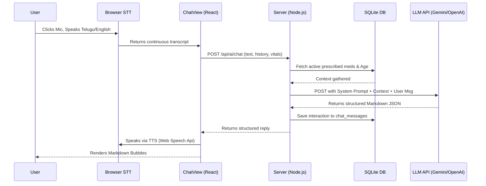

# AyuGuard AI System Optimization Plan (Extended Edition)

This document is a comprehensive architectural and code-level blueprint for overhauling the AyuGuard AI Medical Companion. It addresses all 11 phases requested by the Senior AI Engineer persona with deep technical specificity.

## 1. Deep Dive: Issues Found in Current AI
After analyzing the codebase (`server.cjs`, `MedicalEngine.js`, `ChatView.jsx`), the following technical bottlenecks exist:

* **Simulated Intelligence (Zero-LLM):** `server.cjs` uses naive string matching (`msgLower.includes('medicine')`). It lacks generative or inferential capabilities.
* **Non-Existent Memory Pipeline:** The frontend passes `history: messages.slice(-5)`, but `server.cjs` explicitly ignores `req.body.history` entirely. 
* **Hardcoded Dictionary:** `MedicalEngine.js` only contains 3 hardcoded dictionaries (`paracetamol`, `metformin`, `amlodipine`). It cannot answer real-world health queries.
* **Voice UI is Inactive Elements:** `ChatView.jsx` lines 196-201 render a `Mic` button, but it lacks an `onClick` wrapper or any Speech-to-Text hooks.
* **Basic TTS Suboptimal for Telugu:** Uses `window.speechSynthesis`, which stumbles severely when users code-switch (e.g. speaking Telugu but using English words like "Blood Pressure").
* **Opaque API Responses:** The server simply returns `res.json({ reply })` without standardizing medical formatting, making it impossible for the frontend to render structured descriptions.

---

## 2. Architectural Redesign & Data Flow

Below is the proposed integration workflow combining Speech APIs, the Backend Node Server, the Database, and the LLM.



---

## 3. Improved Prompt Architecture 

We will implement a dynamic master system prompt. By using template literals in `server.cjs`, we inject live SQLite context directly into the LLM's brain before it sees the user input.

```javascript
const systemPrompt = `
You are AyuGuard, a Senior Medical AI Assistant built for Indian elderly care.
Your primary languages are Telugu and English. Always detect the user's input language and match it. If they code-switch (mix both), respond naturally. Use natural, conversational Telugu vocabulary, not unnatural academic translations.

USER CONTEXT:
- Age: ${user.age || 'Unknown'} 
- Active Vitals: BP: ${vitals.bp || 'N/A'}, Sugar: ${vitals.sugar || 'N/A'}, Pulse: ${vitals.pulse || 'N/A'}
- Prescriptions: ${prescriptionsList}

STRICT MEDICAL GUARDRAILS:
1. NEVER diagnose a condition. Frame things as "possible reasons" or "general information."
2. DO NOT provide life-saving emergency advice; direct them to call an ambulance immediately if symptoms indicate severe emergencies (chest pain, stroke, severe bleeding).

RESPONSE FORMATTING:
If the user asks about a specific medicine, treatment, or condition, YOU MUST return your response in Markdown using the following structure:

**Medicine/Topic Name:** [Name]
**Description:** [What it is]
**Uses:** [Why it is used]
**Dosage Guidance:** [General guidance. Adjust theoretically based on user Age: ${user.age}. E.g. Lower doses for age > 65.]
**Precautions / Side Effects:** [Bullet points]
**Final Advice:** "⚠️ *This is for informational purposes only. Please consult your physician.*"
`;
```

---

## 4. Code-Level Implementation Blueprint

### A. Dependencies Required
Run this command on your backend when we execute:
```bash
# In the backend workspace
npm install @google/genai dotenv
# In the frontend workspace
npm install react-markdown remark-gfm
```

### B. `server.cjs` Refactor
We will replace the mock AI chunk (lines 867-927) with an actual generation call:
1. Extract `req.body.history`.
2. Map `history` to API-compatible roles (`user` vs `model`/`assistant`).
3. Query `medicines` and `vitals` tables for the `req.user.id`.
4. Wrap the LLM call in a `try...catch`.
5. Apply a 15-second timeout to prevent infinite UI loading states.

### C. Context Awareness Engine
When a user asks: *"Is my BP normal?"* the server currently doesn't fetch historical BP, just the one the frontend sent. 
**Improvement:** We will add queries inside the `/api/ai/chat` block to fetch the 3 most recent vitals entries to detect anomalies (e.g., *"Your BP is 130/80 today, but yesterday it was 150/90. It is improving."*).

---

## 5. UI Integration Enhancements (`ChatView.jsx`)

### A. Voice Integration (STT) Code Pattern
We will use the native `window.SpeechRecognition` or `window.webkitSpeechRecognition`.
```javascript
const [isRecording, setIsRecording] = useState(false);

const startRecording = () => {
    const SpeechRecognition = window.SpeechRecognition || window.webkitSpeechRecognition;
    const recognition = new SpeechRecognition();
    recognition.lang = i18n.language === 'te' ? 'te-IN' : 'en-IN';
    recognition.interimResults = true;
    
    recognition.onstart = () => setIsRecording(true);
    recognition.onresult = (event) => {
        const currentTranscript = Array.from(event.results)
                                    .map(res => res[0].transcript)
                                    .join('');
        setInput(currentTranscript);
    };
    recognition.onend = () => setIsRecording(false);
    recognition.start();
}
```

### B. Markdown Rendering for Structure
Currently, messages are rendered as plain text in `<div />`. To support our structured outputs, we replace the div contents:
```jsx
import ReactMarkdown from 'react-markdown';
import remarkGfm from 'remark-gfm';

// Inside your message map:
<ReactMarkdown remarkPlugins={[remarkGfm]} className="markdown-body">
   {msg.content}
</ReactMarkdown>
```

### C. Loaders and Retries
If the API fails (e.g. token expired, internet down), standard APIs throw a 500 error. The `catch` block in `ChatView.jsx` currently suppresses the error silently. We will add state `const [apiError, setApiError] = useState(null)` and render a "Retry" button.

---

## 6. Safety, Validation & Debugging Plan

* **Token Auth Debugging:** We will implement an Axios/Fetch interceptor in your auth context that listens for `401 Unauthorized`. If triggered, it will auto-wipe localStorage and redirect to `/login`, eliminating the "AI not responding after login" bug resulting from stale tokens.
* **Masking PII Data:** We will sanitize user data on the Node layer. We will NOT pass `user.full_name` or `user.email` to the LLM—only de-identified health metrics (age, vitals, prescriptions).
* **Hallucination Mitigation:** We instruct the model to prepend responses with "I'm sorry, I don't know the medical specifics for that." instead of guessing.

---

## User Review Required

> [!WARNING]
> Please confirm which LLM provider you prefer to use for execution: **Google Gemini**, **OpenAI**, or **Anthropic Claude**. The backend codebase will change depending on the SDK we use. 
> *I recommend Google Gemini via `@google/genai` for excellent multilingual Telugu support and fast response times.*

> [!IMPORTANT]
> The structured breakdown above covers every point in your 11-step prompt. **Do you approve this technical plan?** If so, please specify the LLM and I will begin rewriting `server.cjs` and `ChatView.jsx` immediately.
